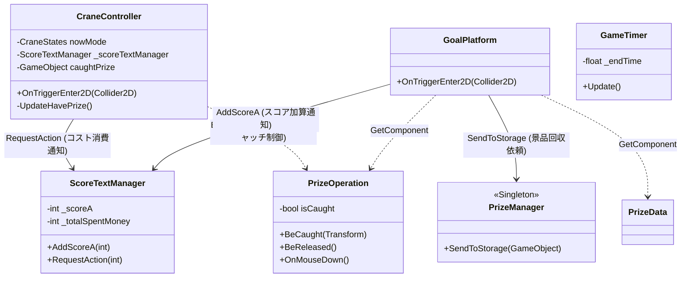
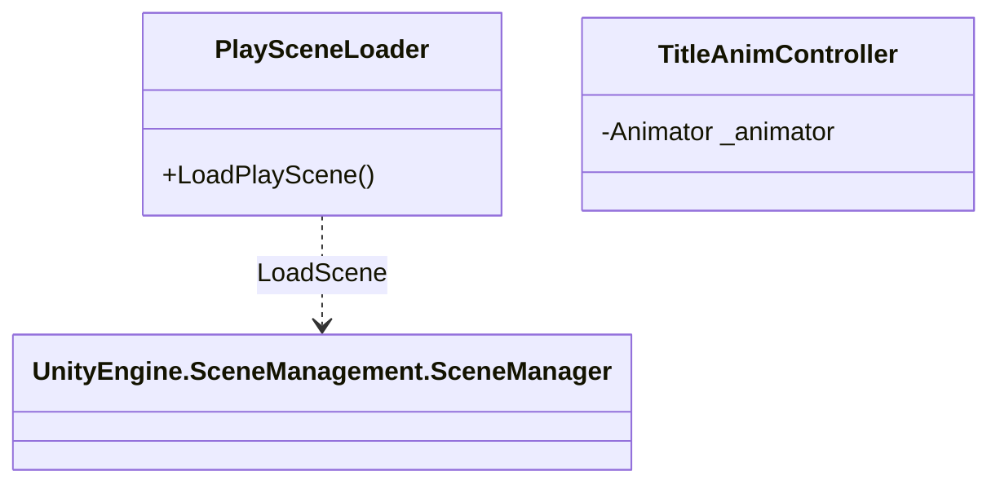

# プロジェクト依存関係図 (Class Dependencies)

このドキュメントは、各シーンにおけるクラス間の依存関係と相互作用を可視化したものです。

## 1. インゲームシーン (In-Game Scene)

インゲームでは、クレーン、景品、およびルール管理の 3 つの主要システムが相互に連携しています。

### システム間の詳細
*   **クレーンシステム**: `CraneController` が入力を受け取り、`ScoreTextManager` にコスト支払いを要求します。景品に触れると `PrizeOperation` の物理状態を制御します。
*   **景品システム**: `PrizeOperation` は 2P プレイヤーの介入（弾き飛ばし）を処理します。`isKinematic` 切り替えにより、クレーンによる運搬をサポートします。
*   **進行管理システム**: `ScoreTextManager` が UI 更新を一元管理し、`GoalPlatform` が景品の到達を検知してスコア加算をトリガーします。`GameTimer` は独立して制限時間をカウントします。

---

## 2. タイトルシーン (Title Scene)

タイトルシーンは、シーン遷移と演出を制御する独立した構成になっています。

### システム間の詳細
*   **シーン管理**: `PlaySceneLoader` がボタン入力等を受けてインゲームシーンへの遷移を実行します。
*   **演出管理**: `TitleAnimController` が背景やロゴのアニメーションを独立して制御します。
